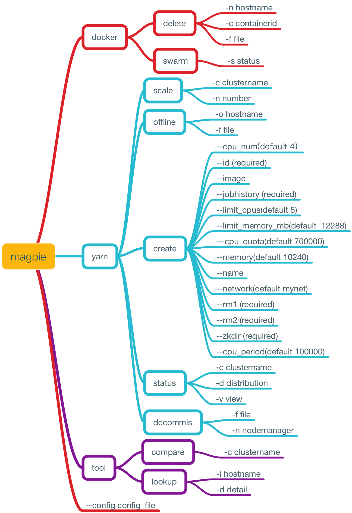

# Magpie  


Magpie is a command line tool for deploying and  managing the Yarn on Docker cluster.

Build and run an yarn cluster on docker, pass the config item to hadoop configuration files through docker ENV.

[Design docs - Yarn on Docker](https://rootsongjc.github.io/docker-practice/docs/td_yarn_on_docker.html)

### How to build the docker image and run a container step by step?

*You should follow the [docker project standard](doc/docker_project_standard.md) to build your own docker image.*

- **Step1**

  Prepare the direcotries for yarn and chown owner to hadoop.

  Download hadoop-2.6.0-cdh5.5.2.tar.gz and install it in docker image. Unzip it and remove the default hadoop configuration files.

- **Step2**

  Put the codec lib.so files into the hadoop native directory.

  Put custom hadoop configuration files to hadoop conf directory.

- **Step3**

  Set the ENV and Entrypoint. 

- **Stop4**

  Run a container with sepecific ENV.


### Build image

Edit Dockerfile and change the base image to your own JDK7 image.

```
./build.sh
docker build -t hadoop-yarn:v0.1 .
```

### Run a container

For example

With hadoop ha

```
docker run -d -e NAMESERVICE=addmp -e ACTIVE_NAMENODE_ID=namenode29 -e STANDBY_NAMENODE_ID=namenode63 -e HA_ZOOKEEPER_QUORUM=192.168.0.1:2181,192.168.0.2:2181,192.168.0.3:2181 -e YARN_ZK_DIR=rmstore -e YARN_CLUSTER_ID= yarnRM -e YARN_RM1_IP=192.168.0.3 -e YARN_RM2_IP=192.168.0.2 -e YARN_JOBHISTORY_IP=192.168.0.3 -e ACTIVE_NAMENODE_IP=192.168.0.1 -e STANDBY_NAMENODE_IP=192.168.0.2  -e HA=yes hadoop-yarn:v0.1 resourcemanager

docker run -d -e NAMESERVICE=addmp -e ACTIVE_NAMENODE_ID=namenode29 -e STANDBY_NAMENODE_ID=namenode63 -e HA_ZOOKEEPER_QUORUM=192.168.0.1:2181,192.168.0.2:2181,192.168.0.3:2181 -e YARN_ZK_DIR=rmstore -e YARN_CLUSTER_ID= yarnRM -e YARN_RM1_IP=192.168.0.3 -e YARN_RM2_IP=192.168.0.2 -e YARN_JOBHISTORY_IP=192.168.0.3 -e ACTIVE_NAMENODE_IP=192.168.0.1 -e STANDBY_NAMENODE_IP=192.168.0.2  -e HA=yes hadoop-yarn:v0.1 nodemanager
```

Without hadoop ha

```
docker run -d -e NANENODE_IP=192.168.0.1 -e RESOURCEMANAGER_IP=192.168.0.1 -e YARN_JOBHISTORY_IP=192.168.0.1 -e HA=no hadoop-yarn:v0.1 resourcemanager

docker run -d -e NANENODE_IP=192.168.0.1 -e RESOURCEMANAGER_IP=192.168.0.1 -e YARN_JOBHISTORY_IP=192.168.0.1 -e HA=no hadoop-yarn:v0.1 nodemanager
```

### ENV included with hadoop HA 

- HA (default yes)

- NAMESERVICE

- ACTIVE_NAMENODE_IP

- STANDBY_NAMENODE_IP

- ACTIVE_NAMENODE_ID

- STANDBY_NAMENODE_ID

- HA_ZOOKEEPER_QUORUM

- YARN_ZK_DIR

- YARN_CLUSTER_ID

- YARN_RM1_IP

- YARN_RM2_IP

- YARN_JOBHISTORY_IP

### ENV included without hadoop HA

- NAMENDOE_IP

- RESOURCEMANAGER_IP

- HISTORYSERVER_IP

### NodeManager resource limit

- CPU_CORE_NUM

- NODEMANAGER_MEMORY_MB

  ​

## Magpie CLI management Tool

### Precondition
- No-password login to all the active resource managers.
- Docker container's name must contain the cluster name.

### Usage

Use magpie -h for help usage.

```
Magpie is  a  CLI tool to manage the Yarn on Docker cluster.
 
 Magpie can be used to inspect the docker,swarm and yarn cluster status, scale the yarn cluster and decommising
 nodemanagers or delete the existed containers.
 
 Usage:
   magpie [command]
 
 Available Commands:
   docker      Docker cluster management tool.
   tool        Other management tool.
   yarn        Yarn cluster management tool.
 
 Flags:
       --config string   config file (default is conf/magpie.toml)
   -t, --toggle          Help message for toggle
 
 Use "magpie [command] --help" for more information about a command.
```



### Configuration

Magpie use [viper](https://github.com/spf13/viper)  to resolve the [toml](https://github.com/toml-lang/toml) configuration file. 

Config file default located at ./conf/magpie.toml

You can use --config to sepcify your custom configuration file.

### Configuration file example

Most configuration items are inherited from docker image, you don't need to specify in the configuration file, unless you want to modify the docker environment variables in the image.

```Toml
[clusters]
#Yarn clsuter name
cluster_name = ["yarn1","yarn2","yarn3"]
#Swarm master ip address
swarm_master_ip = "192.168.0.1"
swarm_master_port = "4000"
nodemanager_exclude_file = "/usr/local/hadoop/etc/hadoop/exclude.txt"

[resource_managers]
#Yarn active resourcemanager ip address
yarn1 = "172.18.0.2"
yarn2 = "172.18.0.3"
yarn3 = "172.18.0.4"

[base_container]
#Base container used for scale the yarn cluster 
yarn1 = "yarn1-nm1"
yarn2 = "yarn2-nm1"
yarn3 = "yarn3-nm1"

[nodemanager]
#Nodemanager default config
HA = "yes"
NAMESERVICE = "dcnameservice"
ACTIVE_NAMENODE_IP= "namenode-001.test.com"
STANDBY_NAMENODE_IP = "namenode-002.test.com"
ACTIVE_NAMENODE_ID = "namenode1"
STANDBY_NAMENODE_ID = "namenode2"
HA_ZOOKEEPER_QUORUM = "zk-001.test.com:2181,zk-002.test.com:2181,zk-003.test.com:2181"
YARN_ZK_DIR = ""
YARN_CLUSTER_ID = ""
YARN_RM1_IP = ""
YARN_RM2_IP = ""
YARN_JOBHISTORY_IP = ""
NAMENODE_IP = ""
RESOURCEMANAGER_IP = ""
CPU_CORE_NUM = 4
NODEMANAGER_MEMORY_MB = 8192
network_mode = "mynet"
limit_cpus = 5
limit_memory_mb = 12288
image = "docker-registry:5000/library/hadoop-yarn:v0.1"
cmd = ["nodemanager"]
```

### Feature

- Inspect the swarm cluster status.
- Inspect the yarn clsuter status.
- Inspect the docker contianer status include contianer's host config and config items.
- Delete docker containers.
- Offline or decomissing yarn nodemanagers.
- Scaling yarn cluster.
- Add a yarn create command to create a new yarn nodemanager for other yarn cluster.

### Build

**Build environment**

go 1.7.4 adm64

**Build magpie on your own platform**

```Shell
go build -o magpie main.go
```

**Build for multi-platform**
```Shell
goxc -d=build -pv=1.0.0 -bc='linux,darwin' -arch='amd64'
```

You need to install [goxc](https://github.com/laher/goxc) by yourself.

### TODO

- Scale and flux the yarn cluster automatically
- Nodemanager registered on resourcemanager repeatability


### Reference

[Docker remote API version 1.23]( https://docs.docker.com/engine/reference/api/docker_remote_api_v1.23/)


[YARN RESTful API version 2.6.0]( https://hadoop.apache.org/docs/r2.6.0/hadoop-yarn/hadoop-yarn-site/ResourceManagerRest.html)

[Swarm API version 1.2.2](https://docs.docker.com/swarm/swarm-api/)

### About

Author: Jimmy Song 
rootsongjc@gmail.com
[Jimmy's Blog](http://rootsongjc.github.io)

*FYI: If you want to create a yarn cluster with multiple nodemanagers, you need a docker plugins to make the docker container on different hosts can be accessed with each others.*
You need a docker ipam plugin to make the continers located on different hosts can be accessed by each others. 
Try this:https://github.com/rootsongjc/docker-ipam-plugin
You also need a plugin to listen on docker nodes and register container's IP-hostname into a DNS server so that docker containers can recognise each other by the hostname which is the same with the container ID.
